# Blindvault

A self-hosted PWA built for communities that need a secure digital home. It combines an end-to-end encrypted personal vault, encrypted email inbox, encrypted messaging, an anonymous community board, personal website hosting, a resume builder, a local resource directory, and a digital library into a single installable app.

The server operator cannot read your vault files, inbox, or messages. Encryption happens in the browser before anything leaves your device.

> The screenshots below are from the reference deployment **Loveland Homeless Community Resources** (`nocohcr.com`), a Blindvault instance built for people in hard situations: survivors, advocates, case workers, and anyone who needs a quiet place for documents and conversations.

---

## Features

### Dashboard: My Vault

After signing in you land on My vault, encrypted on your device. A prominent "Tell someone you need help" card surfaces the PING feature, which opens your phone's text or call app with a message already typed for a trusted contact. Nothing routes through the server. Below it, the Documents section is where identity papers, immunization records, and court documents are stored, encrypted on the device first. The left rail is the app's full map: vault, files, library, website, explore, resume, notes, forms, and the messaging tools.


---

### Encrypted Files (Cloud Files)

End-to-end encrypted file storage. Names, contents, and search terms are all sealed on the device before upload. The server only ever stores opaque ciphertext keyed by the sha256 hash of the encrypted bytes. You can upload files, select and zip them for download, and search by blind-indexed terms (match any or all terms). A storage meter shows usage against the per-account quota.


---

### Library: Books & Films

Read the books in your vault, PDFs and ebooks, in one place. Mark a book available offline to keep it on the device and read it with no connection; everything is decrypted only on the device. Below your own shelf, Films & TV streams free public-domain and openly-licensed movies and shows from the Internet Archive, with no account and no ads, searchable and filterable by Feature films, Film noir, Silent, Classic TV, Educational, and Cartoons.

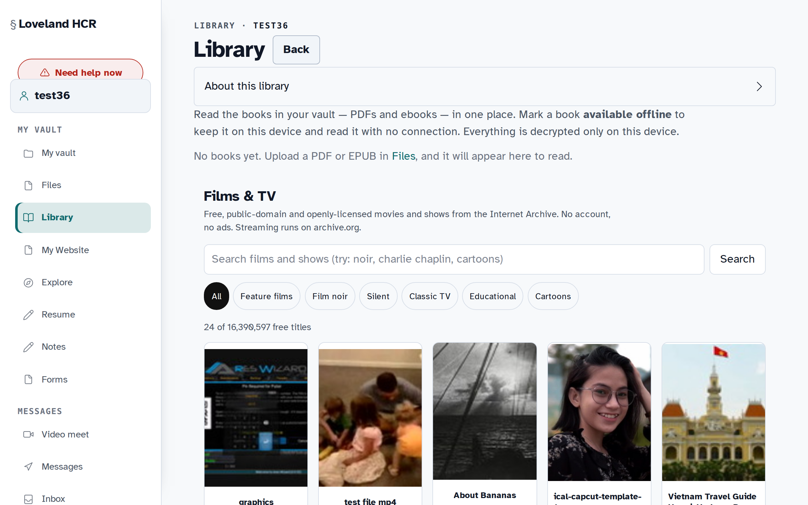

---

### Encrypted Inbox

A full mail client with Compose, Inbox, Starred, Sent, Drafts, Scheduled, Spam, and Trash. Incoming email is sealed to your X25519 public key at the server before storage, so only your device holds the private key needed to read it. The inbox supports inbound mail from external senders, internal casework, and scheduled outbound sends.


---

### Encrypted Messages

Direct one-to-one messaging, encrypted on the device, so the server cannot read the messages. Start a new conversation with another handle, or message yourself to get a private, encrypted space for notes.

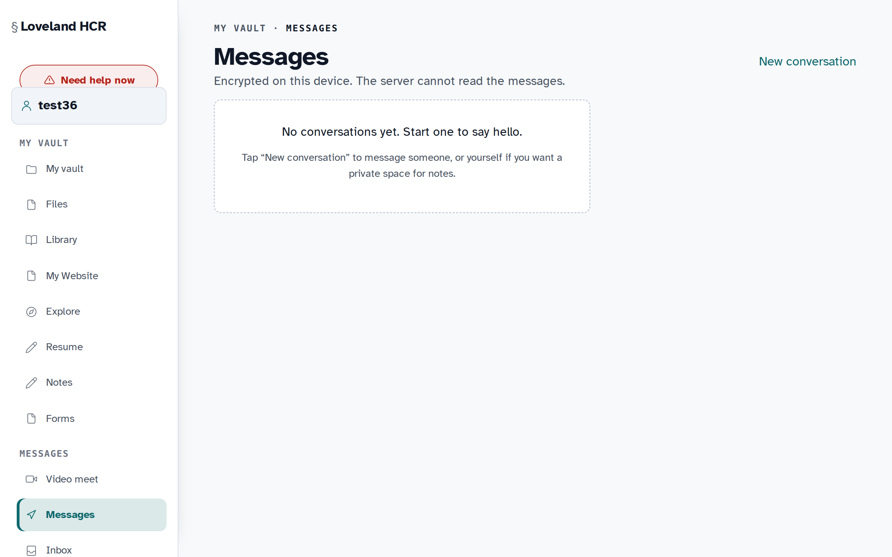

---

### Community Board

A public Local Board for the community, a local bulletin where posts are visible to anyone and expire after 7 days. Categories cover Resource updates, Warnings, Help needed, Help offered, Events, Groups & Meetups, Volunteer, Free / Give away, Rides, Sublet / Couch, Lost & Found, and General. No account is required to read or post.


Creating a post is a simple form: pick a category, add a title and details, and optionally attach event details (start/end time and venue). When you create a post you get a one-time private key, and only someone holding that key can edit, renew, or delete it.


---

### Explore

Discover personal sites built by the community, each with a live preview thumbnail generated on publish. Sort by newest and open any handle's site at `<handle>.<yourdomain>` (e.g. `info.nocohcr.com`).


---

### Personal Websites: Builder

Claim a handle and get a personal site at `<handle>.yourdomain.com`. The Builder is a WYSIWYG editor: add blocks (Heading, Text, Button, Image, List, Divider, Spacer, Section, Columns, Navigation, Tabs), arrange them by dragging the handle, and restyle the whole page with one-click theme presets (Clean Light, Aurora, Ink on Paper, Warm Rose, Deep Ocean, Midnight, Forest, Sunset, Slate Pro, High Contrast). Start from a template or a blank page.


A Code view is available for editing the underlying HTML/CSS directly. JavaScript is stripped at publish and blocked by CSP, so published sites are static HTML/CSS only.


---

### Resume Builder

Build a structured resume with a live preview. Reorder sections (Education, Projects, Skills, Experience) by drag or arrow keys, fill in roles inline, switch layout (e.g. Sidebar) and font, then share it as a link at `/r/your-name` or export a PDF.


---

### Digital Library: Offline Resources

Free, durable, offline-capable resources built for low-bandwidth connections, low-end Android phones, and people on the move. Paste a link to a supported video or song and the server fetches it and hands the file back, with no account, no ads, and no tracking. Choose video (.mp4) or music/audio (.mp3) and a quality tier.


---

### Resources Directory

Local services in Larimer County, browsable with no account. Quick-pick tiles cover Emergency, Hotlines, Food banks, Know your rights, Directions, Safe routing, Download Books & Videos, the Community Board, and the Community Forum. Search across listings (e.g. *2-1-1 Colorado*) and, for each result, open the website, view it on a map, or save it to your vault.


---

### Forms Library

Pre-built documents you can hand to staff, the DMV, a clinic, or a court: Personal data sheet, Letter of authorization, Income & hardship statement, Colorado HIPAA Release, the DR 2153 stolen-ID affidavit, Colorado Birth Certificate Request, and more. Your vault profile fills in the parts you've already entered (name, address, contacts) so you're not writing them by hand each time, and everything is generated on the device. The server never sees the blanks.


---

### Directions & Safe Routing

Get walking, biking, or driving directions for the local area using a locally hosted routing engine, with no data sent to Google or any third party. Long-press the map to drop a destination or start pin. A banner links to the Flock camera safe-routing map, which can route around automated license-plate readers.


---

### Emergency Message

Reach a registered vault holder without creating an account, for when you need to get a message or document to someone fast and signing up isn't an option. The message and any attachment are encrypted in the browser before they leave. To avoid leaking who exists, you see the same confirmation whether or not the recipient handle is real, and there's no read receipt.


---

### Know Your Rights

Short, printable cards covering common encounters: police stops, ICE and immigration agents, landlords and housing, workplace and wages, hospitals and medical care, and child-welfare (CPS) visits. Carry them in a wallet, save them to the vault, or memorize the scripts. Available in English and Spanish. (General guidance, not legal advice.)


---

### Settings

Manage appearance (Auto / Light / Dark / High contrast), language (English / Español), accessibility (Easy read, with larger text and spacing), your session, and an optional sign-in password that unlocks the vault without typing the 12-word recovery phrase.


---

### About

The About page explains the model in plain language: end-to-end encryption, a private vault, a resource map that routes on the operator's own servers (no Google, no tracking), encrypted messages, an optional Community Chat AI that runs on-server and is never used to train outside models, and full offline operation once installed as a web app.


---

### Mobile

Blindvault installs as a PWA on any phone. The layout is designed for low-end devices on mobile data.

| Dashboard | Inbox | Messages |
|---|---|---|
|  |  | 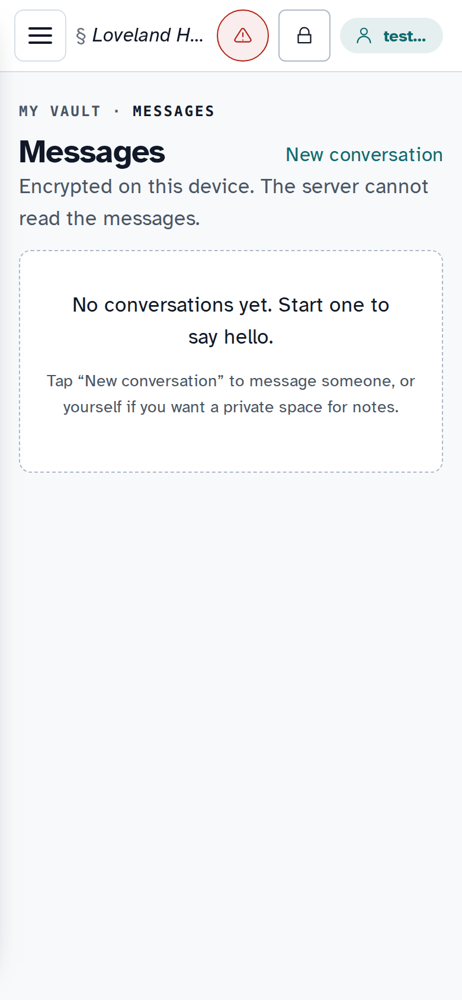 |

| Board | New post | Explore |
|---|---|---|
|  | 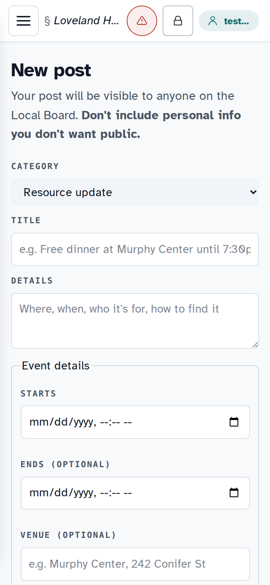 |  |

| Files | Library | Builder |
|---|---|---|
| 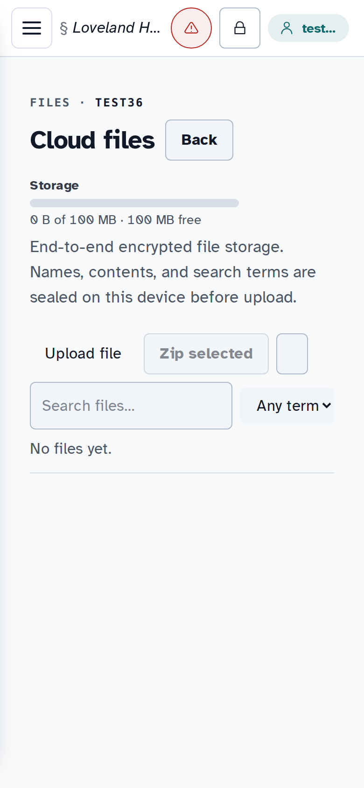 | 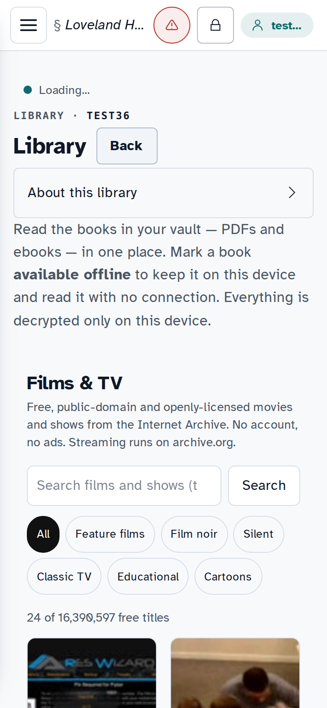 | 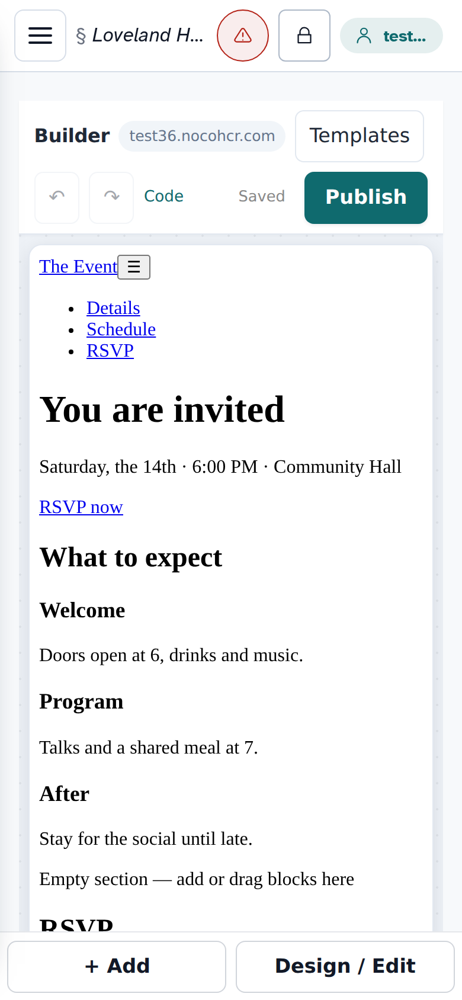 |

| Resume | Digital library | Resources |
|---|---|---|
|  | 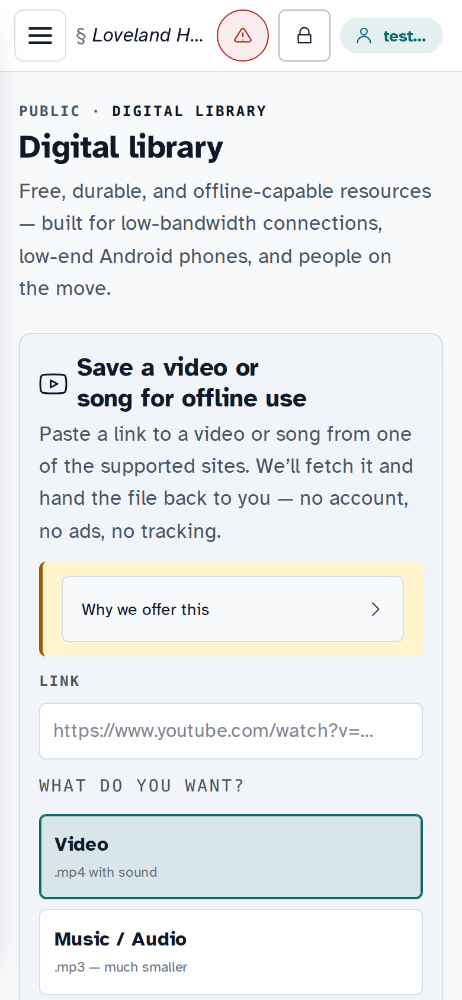 |  |

| Forms | Directions | Emergency |
|---|---|---|
| 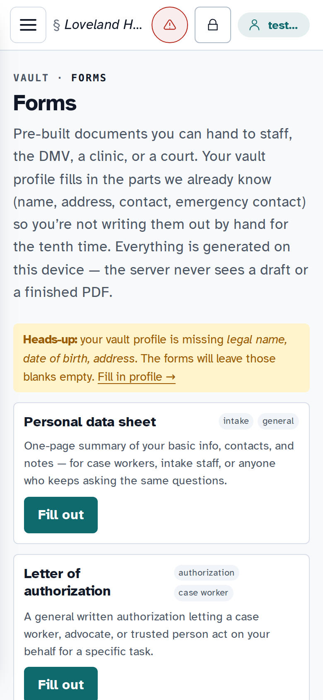 |  |  |

| Know your rights | Settings | About |
|---|---|---|
| 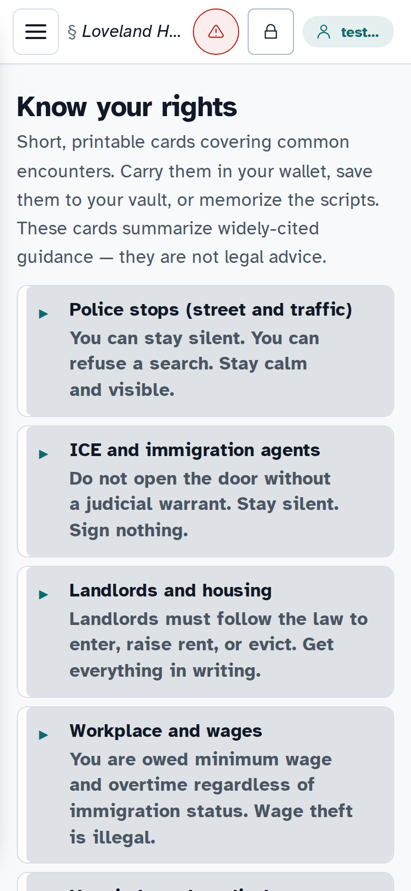 | 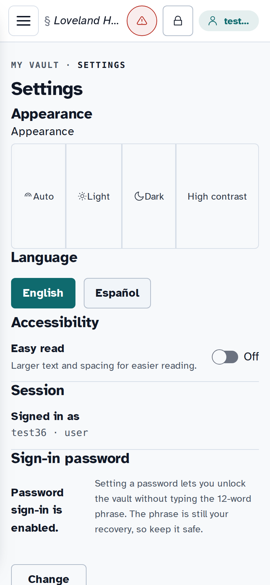 | 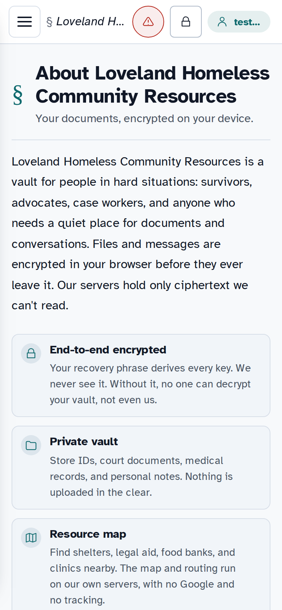 |

---

## Architecture

```
Browser / Mobile PWA
        |  HTTPS
        v
     nginx (edge)
        |
        +-- /var/www/blindvault/      Static frontend (SPA)
        +-- /api/*         ->  blindvault-api    :8088  (Rust/Axum + PostgreSQL)
        +-- /api/sites/*   ->  bv-sites          :8800  (Node.js)
        +-- /api/board/*   ->  bv-board          :8802  (Node.js)
        +-- /api/resume/*  ->  bv-resume         :8805  (Node.js)
        +-- /api/schedule  ->  bv-schedule       :8798  (Node.js)
        +-- /api/v1/messaging/ -> bv-messaging   :8801  (Node.js)
        +-- /api/download/ ->  bv-download-proxy :8082  (Python/yt-dlp)
        +-- /api/books/*   ->  bv-book-proxy     :8083  (Python)
        +-- /api/route     ->  bv-route-proxy    :8084  (Python/Valhalla)
        +-- /site-thumbs/  ->  /var/lib/bv-shots/thumbs/
        +-- /r/<slug>      ->  /var/lib/bv-resume/shared/
```

All backend services bind to `127.0.0.1` only. nginx is the sole public listener. See [ARCHITECTURE.md](ARCHITECTURE.md) for the full diagram.

---

## Security

- **Vault files** are encrypted in the browser before upload. The server stores opaque ciphertext and cannot decrypt it.
- **Inbox email** is sealed to your X25519 public key before storage. The server never holds plaintext messages.
- **User sites** are sanitised server-side with DOMPurify and served with `script-src 'none'` CSP. JavaScript cannot run on published sites.
- **Board posts** require no login. Ownership is a sha256-hashed one-time secret with timing-safe comparison on every request.
- **nginx CSP** blocks all external scripts, enforces `frame-ancestors 'none'`, and runs Trusted Types in report-only mode.

See [SECURITY.md](SECURITY.md) for the full model.

---

## Self-Hosting

See [SELF-HOSTING.md](SELF-HOSTING.md) for the full guide.

Quick steps:

1. Install nginx (with `headers-more`), Node.js 20+, Python 3.11+, PostgreSQL 16
2. Run `deploy/postgres/init.sql` to create the database role
3. Copy the `blindvault-api` binary and install the systemd unit from `deploy/systemd/`
4. Start each Node.js service (`bv-sites`, `bv-board`, `bv-blobstore`, `bv-resume`, `bv-schedule`, `bv-messaging`)
5. Copy nginx configs from `deploy/nginx/` and update your domain name
6. Deploy the frontend to your web root and run `node bv-build.mjs`

Optional services that degrade gracefully if absent:

- `bv-shots` (Playwright/Chromium): site thumbnails and PDF export
- `bv-route-proxy` (Valhalla + Nominatim): directions
- `bv-download-proxy` (yt-dlp): video and audio download
- `bv-book-proxy` (Kavita): book management

---

## Building the Frontend

```bash
node bv-build.mjs

# BUILDER_CHUNK=bv-builder-XXXXXXXX.js
# NEW_MAIN=main-XXXXXXXX.js
# TO DEPLOY: point index.html at main-XXXXXXXX.js and bump the SW version.
```

See [BUILD.md](BUILD.md) for details.

---

## Repository Structure

```
frontend/
+-- bv-build.mjs              Build script
+-- bv-builder.src.js         WYSIWYG site builder (#/studio)
+-- bv-resume.src.js          Resume builder (#/resume)
+-- bv-films.src.js           Films & TV section (#/library)
+-- bv-*-route.js             Route registration modules
+-- static/                   HTML, CSS, icons, i18n, forms

services/
+-- bv-blobstore/             E2EE blob store (Node.js)
+-- bv-board/                 Anonymous community board (Node.js)
+-- bv-sites/                 User personal websites (Node.js)
+-- bv-resume/                Resume builder backend (Node.js)
+-- bv-shots/                 Screenshot and PDF renderer (Node.js/Playwright)
+-- bv-schedule/              Scheduled email send (Node.js)
+-- bv-messaging/             E2EE messaging relay (Node.js)
+-- bv-inbox-smtp/            Postfix to encrypted inbox bridge (Node.js)
+-- bv-route-proxy/           Directions proxy (Python/Valhalla)
+-- bv-download-proxy/        Video/audio download proxy (Python/yt-dlp)
+-- bv-book-proxy/            Book proxy (Python/Kavita)
+-- bv-outbox-relay/          DKIM outbound SMTP relay (Python)

deploy/
+-- nginx/                    nginx vhost configs
+-- postgres/                 Database init SQL and pg_hba snippet
+-- systemd/                  systemd unit for blindvault-api
```

---

## License

[AGPL-3.0](LICENSE)

Anyone who runs a modified version as a network service must publish their source changes under the same license.
