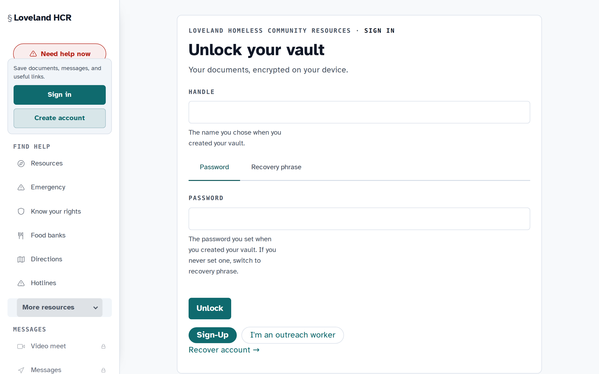
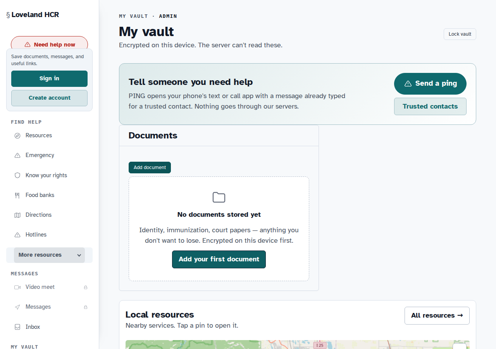
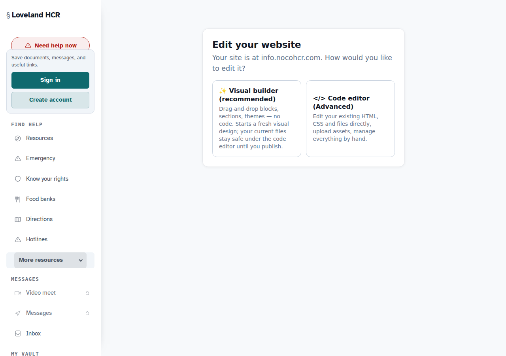
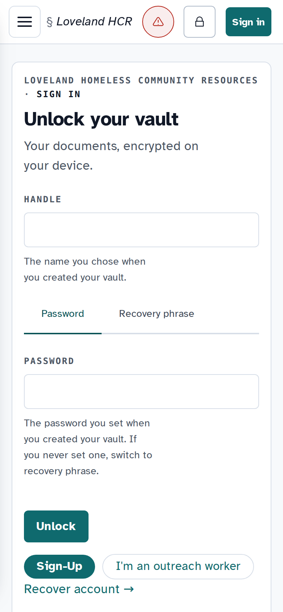

# Blindvault

A privacy-first Progressive Web App (PWA) for communities that need a secure, self-hosted digital home — encrypted personal vault, anonymous community board, personal websites, resume builder, digital library, and more.

Blindvault is designed so **the server operator cannot read your data**. Files are encrypted in your browser before upload; the server stores and serves opaque ciphertext only.



---

## Features

### Encrypted Personal Vault
Store files with client-side end-to-end encryption. Your master key is derived from your password in the browser and never transmitted to the server. The server holds only ciphertext blobs keyed by their sha256 hash.




---

### Encrypted Inbox
Receive email into a sealed inbox. Incoming messages are encrypted to your public key at the server edge before storage — only your device can decrypt them.


---

### Personal Websites
Claim a handle and publish a personal website at `<handle>.yourdomain.com`. The built-in WYSIWYG editor requires no coding knowledge. JavaScript is stripped at publish and blocked by CSP — sites are safe static HTML/CSS only.




---

### Community Board
An anonymous local classifieds board — no account required. Post resources, warnings, events, rides, free items, and more. Post ownership is a one-time private key returned at creation; only the holder can edit, renew, or delete their post.


---

### Explore Directory
Browse published community sites with live preview thumbnails.


---

### Resume Builder
Build a structured resume with a live preview, publish it as a shareable public link, or export it as a one-click PDF.


---

### Resources & Digital Library
A curated local resource directory, Internet Archive search and streaming, and a digital book/video downloader.


---

### Mobile-First PWA
Installable on any device. Designed for low-end phones on mobile data — no heavy framework, small bundle, offline-capable service worker.

| Login | Board | Explore |
|---|---|---|
|  |  |  |

---

## Architecture

```
Browser / Mobile PWA
        │  HTTPS
        ▼
     nginx (edge)
        │
        ├── /var/www/blindvault/     Static frontend (SPA)
        ├── /api/*        →  blindvault-api   :8088  (Rust/Axum + PostgreSQL)
        ├── /api/sites/*  →  bv-sites         :8800  (Node.js)
        ├── /api/board/*  →  bv-board         :8802  (Node.js)
        ├── /api/resume/* →  bv-resume        :8805  (Node.js)
        ├── /api/schedule →  bv-schedule      :8798  (Node.js)
        ├── /api/v1/messaging/ → bv-messaging :8801  (Node.js)
        ├── /api/download/ → bv-download-proxy :8082 (Python/yt-dlp)
        ├── /api/books/*  →  bv-book-proxy    :8083  (Python)
        ├── /api/route    →  bv-route-proxy   :8084  (Python/Valhalla)
        ├── /site-thumbs/ →  /var/lib/bv-shots/thumbs/
        └── /r/<slug>     →  /var/lib/bv-resume/shared/
```

All backend services bind to `127.0.0.1` only. nginx is the sole public listener. See [ARCHITECTURE.md](ARCHITECTURE.md) for the full diagram and data flow.

---

## Security Model

- **Client-side E2EE** — vault files are encrypted in the browser before upload. The server stores opaque ciphertext and cannot decrypt it without the user's password.
- **User sites** — HTML is sanitised server-side (DOMPurify/jsdom) and served with `script-src 'none'` CSP. JavaScript cannot run on published sites.
- **Anonymous board** — no login required. Post ownership is a `sha256`-hashed one-time secret; timing-safe comparison on every management request.
- **Zero plaintext email storage** — incoming email is sealed to the recipient's X25519 public key before being stored.
- **Strict nginx CSP** — the main app CSP blocks all external scripts, enforces `frame-ancestors 'none'`, and is in Trusted Types report-only mode.

See [SECURITY.md](SECURITY.md) for the full security model.

---

## Self-Hosting

See [SELF-HOSTING.md](SELF-HOSTING.md) for the complete step-by-step guide.

**Quick overview:**

1. Install nginx (with `headers-more`), Node.js 20+, Python 3.11+, PostgreSQL 16
2. Run `deploy/postgres/init.sql` to create the database role
3. Copy the `blindvault-api` binary and install the systemd unit from `deploy/systemd/`
4. Start each Node.js service (`bv-sites`, `bv-board`, `bv-blobstore`, `bv-resume`, `bv-schedule`, `bv-messaging`)
5. Copy nginx configs from `deploy/nginx/` and update your domain name
6. Deploy the frontend to your web root and run `node bv-build.mjs`

**Optional services** (graceful degradation if absent):
- `bv-shots` (Playwright/Chromium) — site thumbnails and PDF export
- `bv-route-proxy` (Valhalla + Nominatim) — directions feature
- `bv-download-proxy` (yt-dlp) — Digital Library video/audio download
- `bv-book-proxy` (Kavita) — Digital Library book management

---

## Building the Frontend

The frontend is a vanilla JS SPA extended by `bv-build.mjs`. See [BUILD.md](BUILD.md) for full details.

```bash
# Extend and hash the frontend bundle
node bv-build.mjs

# Output:
# BUILDER_CHUNK=bv-builder-XXXXXXXX.js
# NEW_MAIN=main-XXXXXXXX.js
# TO DEPLOY: point index.html at main-XXXXXXXX.js and bump the SW version.
```

---

## Repository Structure

```
frontend/
├── bv-build.mjs              Build script (patches + extends the base bundle)
├── bv-builder.src.js         WYSIWYG site builder (#/studio)
├── bv-resume.src.js          Resume builder (#/resume)
├── bv-films.src.js           Films & TV section (#/library)
├── bv-*-route.js             Route registration modules
└── static/                   Static assets (HTML, CSS, icons, i18n, forms)

services/
├── bv-blobstore/             Content-addressed E2EE blob store (Node.js)
├── bv-board/                 Anonymous community board (Node.js)
├── bv-sites/                 User personal websites (Node.js)
├── bv-resume/                Resume builder backend (Node.js)
├── bv-shots/                 Screenshot + PDF renderer (Node.js/Playwright)
├── bv-schedule/              Scheduled email send (Node.js)
├── bv-messaging/             E2EE app-to-app messaging relay (Node.js)
├── bv-inbox-smtp/            Postfix → encrypted inbox bridge (Node.js)
├── bv-route-proxy/           Directions proxy → Valhalla/Nominatim (Python)
├── bv-download-proxy/        Video/audio download proxy → yt-dlp (Python)
├── bv-book-proxy/            Book search/download proxy → Kavita (Python)
└── bv-outbox-relay/          DKIM outbound SMTP relay (Python)

deploy/
├── nginx/                    nginx vhost configs
├── postgres/                 Database init SQL and pg_hba snippet
└── systemd/                  systemd unit for blindvault-api
```

---

## License

[AGPL-3.0](LICENSE)

Copyleft: anyone who runs a modified version as a network service must publish their changes under the same license.
